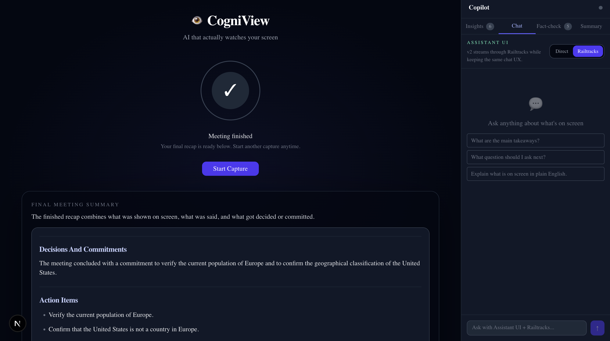

# CogniView

**AI that actually watches your screen.**

CogniView is an autonomous meeting copilot for presentations and screen shares. It watches the live screen, listens to the conversation, helps with contextual chat during the meeting, fact-checks risky claims, and generates a final summary after the meeting ends.

[Watch the demo](https://youtu.be/6ijM04DkQKk)



## Why it exists

Most meeting tools only capture transcript. CogniView is built for meetings where the *screen* matters just as much as the words:

- presentations
- research walkthroughs
- classroom demos
- high-stakes explanations
- live fact-checking during a talk

The goal is simple: turn an AI from a passive recorder into an active meeting participant.

## What it does

- Watches the shared screen and generates live insights
- Transcribes meeting audio from screen audio and mic when available
- Powers a live copilot chat based on what is currently on screen
- Fact-checks spoken or visual claims in context
- Produces a final summary that combines what was shown, what was said, and what was verified

## Sponsor Stack

### Railtracks

Railtracks is the backbone of the most agentic parts of CogniView.

We use it to orchestrate:

- **Fact Check Flow**
  - extract check-worthy claims from screen and speech
  - gather evidence
  - run judge and reviewer agents
  - retry weak results
  - persist lessons for future runs
- **Meeting Summary Flow**
  - combine screen context, transcript context, and fact-check findings
  - draft a final summary
  - review and improve the summary
  - store reusable lessons across sessions

This is not a single prompt wrapped in a UI. Railtracks is what makes the fact-checking and summary system structured, traceable, and self-improving.

### Assistant UI

Assistant UI powers the live copilot chat experience in the sidebar.

We use it to deliver:

- a polished, ChatGPT-style in-app copilot UX
- streaming chat responses
- a shared UI that works with both direct model responses and Railtracks-backed chat

That let us keep the chat experience fast and familiar while still supporting deeper agent workflows behind the scenes.

### Lovable

Lovable helped us move faster on product direction and experience design. We used it to rapidly explore framing, flows, and interface direction before tightening everything into the final implementation.

## How it works

CogniView is split into two layers:

### Next.js app

The app handles:

- screen capture
- audio capture
- transcription uploads
- live insights
- Assistant UI chat
- fact-check and summary UI

### Python Railtracks service

The Railtracks service handles:

- fact-check orchestration
- summary orchestration
- reviewer loops
- lesson memory across runs

This keeps the frontend fast while letting the deeper agent workflows run in a clean, inspectable Python service.

## Tech

- Next.js
- React
- TypeScript
- Python
- Railtracks
- FastAPI
- Uvicorn
- Assistant UI
- OpenAI API
- Anthropic SDK
- Tailwind CSS
- shadcn/ui
- Screen Capture API
- MediaRecorder API
- Web Audio API

## Getting Started

### 1. Install app dependencies

```bash
npm install
```

### 2. Configure environment

Copy `.env.example` to `.env.local` and add the keys you want to use.

Important variables:

- `OPENAI_API_KEY`
- `ANTHROPIC_API_KEY`
- `RAILTRACKS_AGENT_URL`
- `NEXT_PUBLIC_ASSISTANT_UI_DEFAULT_MODE`

### 3. Run the Railtracks service

```bash
python3 -m venv services/meeting-agent/.venv
source services/meeting-agent/.venv/bin/activate
pip install -r requirements.txt
uvicorn app:app --app-dir services/meeting-agent --reload --port 8000
```

### 4. Point the app at Railtracks

Add this to `.env.local`:

```bash
RAILTRACKS_AGENT_URL=http://127.0.0.1:8000
NEXT_PUBLIC_ASSISTANT_UI_DEFAULT_MODE=v2
```

### 5. Run the app

```bash
npm run dev
```

Open [http://localhost:3000](http://localhost:3000).

## Key Environment Variables

### Core models

- `LLM_PROVIDER`
- `OPENAI_MODEL`
- `ANTHROPIC_MODEL`
- `RAILTRACKS_LLM_PROVIDER`
- `RAILTRACKS_OPENAI_MODEL`
- `RAILTRACKS_ANTHROPIC_MODEL`

### Fact-checking

- `OPENAI_FACTCHECK_IMAGE_MODEL`
- `OPENAI_FACTCHECK_REASONING_MODEL`
- `FACTCHECK_MAX_CLAIMS`
- `FACTCHECK_VALIDATION_ATTEMPTS`

### Chat

- `NEXT_PUBLIC_ASSISTANT_UI_DEFAULT_MODE`

## Fact-check flow

When fact-check runs, CogniView can:

1. extract claims from the live screen and recent speech
2. prepare a quick background verdict
3. deepen the result through the Railtracks fact-check workflow
4. return grounded verdicts with sources
5. fold important findings into the final meeting summary

## Final summary

The final recap is built to answer:

- What was shown?
- What was said?
- What was verified or contradicted?
- What mattered most from the meeting?

## Submission note

Railtracks is declared in the root [`requirements.txt`](requirements.txt), and the local Python service in [`services/meeting-agent/app.py`](services/meeting-agent/app.py) uses it directly for the fact-check and summary flows.
